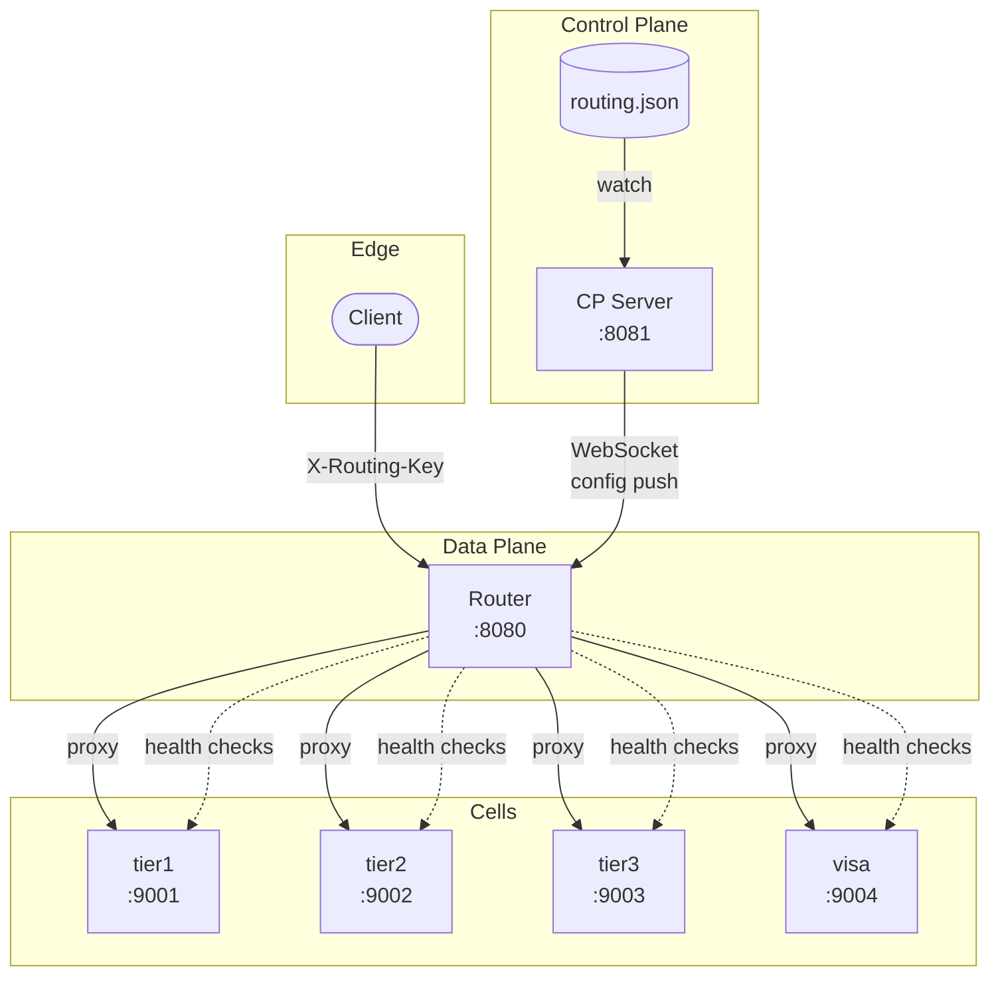

# Architecture

> **Quick Reference**: This document is a concise cheat sheet. For detailed explanations, tradeoff reasoning, and failure mode analysis, see the [README](README.md) and [milestone docs](docs/milestones/).

## Invariants

See [Architectural Invariants](README.md#architectural-invariants) for full explanation. Summary:

| Invariant | One-liner |
|-----------|----------|
| Control plane never in request path | Routing uses local state only; CP failure doesn't affect requests |
| Atomic config updates | All-or-nothing swap via `atomic.Value`; no partial state |
| Graceful degradation | Last-known-good config on CP outage or invalid config |
| Local resilience state | Health checks, circuit breakers, limits are per-router |
| Fail-safe routing | Unknown keys → tier3 (never 5xx for missing config) |

## Topology



| Component | Port | Endpoints | Role |
|-----------|------|-----------|------|
| Control Plane | 8081 | `/connect`, `/health` | Config source, WebSocket broadcast |
| Data Plane | 8080 | `/*`, `/debug/config` | Request routing, health checks, circuit breakers |
| Cells | 9001-9004 | `/*`, `/health` | Upstream backends |

**Failure isolation**: CP crashes don't affect DP routing. Unhealthy upstreams trigger automatic fallback.

## Routing Model

**Two-level indirection**: `routingKey → placementKey → endpointURL`

```
customer-123 → tier2 → http://tier2-cell:8080
customer-789 → dedicated-cell-1 → http://dedicated-cell:8080
```

**Why**: Decouples tenant identity from infrastructure. Multiple tenants per placement. Placement migration without remapping all tenants.

**Default**: Unknown keys → tier3 (fail-safe over fail-fast).

**Thread safety**: `atomic.Value` pointer swap. Zero lock contention on read path.

## Config Updates

**Validation**: Both CP and DP check:
- All placements exist
- No duplicate keys
- Valid URLs and version

**On failure**:
- CP: logs error, doesn't broadcast
- DP: sends nack, keeps last-good

**Application**: Atomic pointer swap. All-or-nothing.
## Failure Handling

| Condition | Response | Reason |
|-----------|----------|--------|
| Connection refused | 502 or fallback | Upstream not listening |
| Dial timeout (5s) | 502 or fallback | Network partition |
| Response timeout (10s) | 504 or fallback | Upstream overload |
| Upstream 5xx | Proxied + circuit breaker | Upstream owns error; track failures |
| Health check failed | Route to fallback | Active probe detected unhealthy endpoint |
| Circuit open | 503 or fallback | Too many consecutive failures |
| Concurrency limit | 429 | Router protecting itself from overload |
| Invalid config | Keep last-good | Never break traffic |

**Automatic fallback**: When primary placement is unhealthy or circuit is open, route to configured fallback placement. If no fallback configured, route to default placement (tier3).

## Design Decisions

**Full snapshots over deltas**: CP sends complete config every time. Simpler reconnection, no versioning conflicts. Cost: ~10KB per update.

**Atomic pointer swap**: `atomic.Value` eliminates locks on read path. Critical for throughput.

**Exponential backoff**: 1s → 60s prevents thundering herd on CP restart.

**Fail-safe defaults**: Unknown keys → tier3 instead of 5xx. New customers work immediately. Typos don't break prod.

**Health-aware routing**: Active HTTP checks detect unhealthy endpoints. State tracked in-memory per router. Failed health checks trigger automatic fallback routing.

**Circuit breakers**: Per-endpoint state machine (closed → open → half-open). Opens after N consecutive failures, stays open for timeout period, tests recovery in half-open state.

**Concurrency limits**: Semaphore-based per-placement limits. Early rejection (429) prevents router saturation. No distributed coordination; each router enforces limits independently.

## Explicit Non-Goals

**Auth**: Assumes `X-Routing-Key` validated upstream.

**Distributed rate limiting**: Per-router concurrency limits only. No Redis, no shared state, no cross-router coordination. Acceptable variance between routers.

**Automatic retries**: No automatic retry on upstream failure. Retries require idempotency guarantees. Client layer knows request semantics, router doesn't. Automatic retries amplify cascading failures (retry storm).
