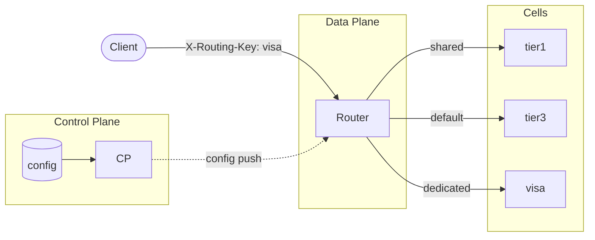

# Cell Routing from Scratch



A working implementation of cell-based ingress routing that demonstrates control plane / data plane separation from first principles. This repository explores how production edge systems maintain local routing decisions while distributing centralized configuration and why that architectural pattern matters for reliability at scale.

## What This Repository Contains

**A progression of four milestones** that build a functional ingress router with control plane distribution, health-aware routing, circuit breaking, and overload protection. Each milestone preserves core invariants (local routing decisions, atomic config updates, graceful degradation) while adding operational capability.

**A collection of design annexes** that examine architectural questions beyond the core implementation: request processing pipelines, caching placement, rate limiting strategies, authentication boundaries, shuffle sharding, and runtime mappings (Pingora, Cloudflare Workers). These are comparative explorations, not feature proposals.

This is an architectural case study with working code. It demonstrates patterns from production edge systems (Envoy xDS, service mesh control planes, CDN edge nodes) in isolation, with explicit tradeoff documentation.

## How to Read This Repository

**If you want to understand cell-based routing architecture:**
Start with [Milestone 1](docs/milestones/milestone-1.md) and progress through M4. Each milestone is self-contained and runnable. Focus on the "Design Decisions" and "Failure Modes" sections, they explain the architectural reasoning.

**If you want to see control plane / data plane separation:**
Read [Milestone 3](docs/milestones/milestone-3.md) and review the `internal/controlplane/` and `internal/dataplane/` implementations. The WebSocket protocol and reconnection logic demonstrate asynchronous config distribution.

**If you want to explore design tradeoffs:**
Read the [Design Annexes](docs/annexes/README.md). These generalize the lessons from the implementation and compare alternative approaches. Start with "Request Processing Pipelines" and "Caching and CDN" for foundational concepts.

**If you want to run it locally:**
See the Quick Start section below. Docker Compose brings up the full system (control plane + router + demo cells) in one command.

## What This Is Not

**Not a production gateway.** This repository omits distributed tracing, metrics pipelines, TLS termination, and operational tooling required for production deployment. It demonstrates architectural patterns, not production-ready infrastructure.

**Not a framework.** This is not designed to be imported or extended. It's an educational artifact that makes implicit patterns explicit.

**Not feature-complete.** Capabilities like rate limiting, authentication, and WAF integration are explored in annexes but excluded from the core implementation to maintain focus on routing and resilience fundamentals.

## Architectural Invariants

These constraints define the system and hold across all milestones:

**Control plane never in request path**  
Routing decisions use only local, in-memory state. No RPC to control plane during request processing. Config updates are asynchronous, data plane applies them when received, not when requested. This preserves availability (data plane survives control plane failure) and performance (no blocking on remote calls).

**Atomic configuration updates**  
New routing tables are validated before application. Swaps are atomic via `atomic.Value` no partial state visible to concurrent requests. Invalid configs are rejected, previous config remains active. This prevents invalid routing state from affecting traffic.

**Graceful degradation**  
Data plane operates indefinitely with last-known-good config when control plane is unavailable. Routers do not block, fail, or degrade when control plane is unreachable. This decouples data plane availability from control plane availability.

**Local resilience state**  
Health checks, circuit breakers, and overload limits maintain per-router state. Routers make independent failover choices based on local observations. This trades consistency for autonomy different routers may route the same key differently during transient failures.

These invariants mirror patterns from production edge systems: Envoy operates from local snapshots pushed via xDS, service meshes maintain data plane autonomy, edge nodes make routing decisions from cached config.

## Milestone Progression

This progression demonstrates how ingress routers evolve from static configuration to centralized orchestration with local resilience:

| Milestone | Capability | Architectural Tradeoff |
|-----------|------------|------------------------|
| **[M1: Static Routing](docs/milestones/milestone-1.md)** | In-memory routing tables, streaming HTTP proxy | Zero operational complexity; zero config flexibility |
| **[M2: Atomic Config Reload](docs/milestones/milestone-2.md)** | File-based hot-reload with validation | Local config management; manual propagation across fleet |
| **[M3: Control Plane Distribution](docs/milestones/milestone-3.md)** | WebSocket config push from centralized control plane | Centralized config source; data plane maintains autonomy |
| **[M4: Local Resilience](docs/milestones/milestone-4.md)** | Health checks, circuit breakers, concurrency limits | Per-router resilience state; no cross-router coordination |

### Key Architectural Transitions

**M1 → M2**: Routing tables become mutable. Introduced validation (pre-apply checks) and atomicity (no partial updates). Last-known-good fallback prevents invalid config from breaking routing.

**M2 → M3**: Separated config source from config application. Control plane becomes authoritative; data plane receives updates asynchronously. Data plane survives control plane failure indefinitely.

**M3 → M4**: Added local resilience. Health checks detect unhealthy upstreams, circuit breakers prevent cascading failures, concurrency limits protect against overload. All state remains local different routers may make different routing decisions during failures.

Each milestone is independently runnable and includes failure mode analysis.

## Design Annexes

These documents explore architectural questions beyond the core implementation. They are comparative and exploratory examining design spaces, tradeoffs, and alternative approaches.

### Fundamentals

**[Request Processing Pipelines](docs/annexes/request-processing-pipelines.md)**  
How modern ingress systems compose multiple concerns (WAF, auth, rate limiting, routing) as sequential stages. Short-circuit semantics, trust boundaries, and performance implications.

**[Caching and CDN](docs/annexes/caching-and-cdn.md)**  
Cache as a pipeline stage. Where caching sits relative to routing (before/after, two-tier). Tenant isolation through cache keys. Invalidation strategies and failure semantics during cell failover.

### Security and Traffic Control

**[Distributed Rate Limiting](docs/annexes/distributed-rate-limiting.md)**  
Per-key rate limiting design space. Local vs distributed enforcement. Tradeoffs in consistency, latency, and operational complexity.

**[Authentication and Routing Keys](docs/annexes/auth-routing-key.md)**  
Trust boundaries for routing metadata. Why authentication must be separated from routing logic. Implications for tenant isolation.

**[WAF and Edge Security](docs/annexes/waf-and-edge-security.md)**  
WAF placement relative to routing and cells. Global edge vs per-cell enforcement.

### Cell Isolation and Sharding

**[Shuffle Sharding](docs/annexes/shuffle-sharding.md)**  
Blast radius isolation through shard assignment. How shuffle sharding interacts with health-aware failover. Operational complexity of managing shard mappings at scale.

### Platform Mappings

**[Pingora Parity](docs/annexes/pingora-parity.md)**  
Mapping data plane semantics to Cloudflare Pingora. Runtime tradeoffs: Go goroutines vs Tokio async, connection pooling, semantic equivalence.

**[Workers Edge Router](docs/annexes/workers-edge-router.md)**  
Cell routing at the edge using Cloudflare Workers. Edge-specific constraints: stateless compute, config from KV. How assumptions change when routing lives at the edge.

See [docs/annexes/README.md](docs/annexes/README.md) for full context on scope and completeness.

## Quick Start

```bash
# Start control plane + router + 4 demo cells
docker compose up --build

# Verify routing (each response includes X-Routed-To, X-Route-Reason headers)
curl -H "X-Routing-Key: visa" http://localhost:8080/    # dedicated cell
curl -H "X-Routing-Key: acme" http://localhost:8080/    # shared tier1
curl -H "X-Routing-Key: unknown" http://localhost:8080/ # default tier3

# Check config source and version
curl http://localhost:8080/debug/config

# Test config propagation: edit config/routing.json, wait ~5 seconds
# Control plane detects change, broadcasts to routers
# Check /debug/config to confirm version update

# Run test suite
go test ./...
```

Router logs and cell logs available via `docker compose logs -f router` and `docker compose logs -f cell-visa`.

## Repository Structure

```
cmd/
├── router/        # Data plane: routing + proxy + CP client
├── control-plane/ # Control plane: WebSocket broadcast
└── cell/          # Demo backend cells
internal/
├── config/        # Parsing, validation, atomic swap
├── routing/       # Routing decision logic
├── proxy/         # HTTP reverse proxy with resilience
├── protocol/      # WebSocket message types
├── controlplane/  # CP server implementation
├── dataplane/     # DP client with reconnection
├── health/        # Active health checking
├── circuit/       # Circuit breaker state machine
├── limits/        # Concurrency and size limits
├── debug/         # Debug endpoints
└── logging/       # Structured JSON logging
config/
├── routing.json           # Control plane config source
└── dataplane-initial.json # Data plane bootstrap config
docs/
├── milestones/    # Milestone specifications
└── annexes/       # Design explorations
```

## Implementation Details

**Routing model**: Two-level indirection (`routingKey → placementKey → endpoint`) with default fallback. Placement keys represent failure domains (dedicated cells, shared tiers). Unknown routing keys default to shared tier; missing routing key header returns 400.

**Configuration separation**:
- Control plane: watches `config/routing.json` (authoritative source)
- Data plane: bootstraps from `config/dataplane-initial.json`, immediately replaced by CP push
- File-only mode: data plane can watch `routing.json` directly (no CP required)
