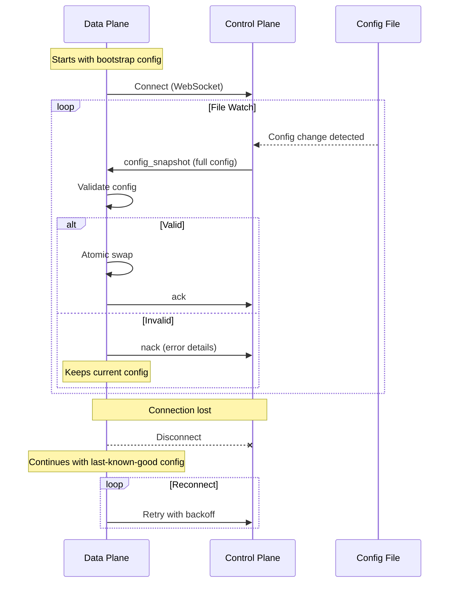

# Milestone 3: Control Plane Distribution

## Architectural Intent

Separate config source from config application. Introduce a control plane as the authoritative source of routing configuration; data plane routers receive updates asynchronously via WebSocket. The critical invariant: **data plane survives control plane failure indefinitely**—routing continues with last-known-good config.

This milestone demonstrates the pattern used in production edge systems: centralized orchestration with local autonomy. The control plane coordinates fleet-wide config, but individual routers operate independently. Control plane unavailability affects config propagation, not request serving.

## Design Constraints

All [architectural invariants](../../README.md#architectural-invariants) are preserved. Key constraints for CP/DP separation:

- **Control plane never in request path**: WebSocket failure does not impact routing
- **Data plane autonomy**: Routers bootstrap from local config, operate indefinitely without CP
- **Push model, full snapshots**: CP broadcasts entire config; DP validates before applying

## CP/DP Interaction



## Implementation Approach

**Control plane** (`cmd/control-plane/main.go`, `internal/controlplane/server.go`):
- Watches `config/routing.json` via file polling (reuses M2 config loader)
- Detects changes by comparing config version field (polls every 2s)
- Broadcasts full config snapshot to all connected data planes via WebSocket
- Tracks connected clients; handles graceful disconnections
- Listens on port 8081, serves `/connect` WebSocket endpoint and `/health` HTTP endpoint

**Data plane** (`internal/dataplane/client.go`):
- Connects outbound to control plane WebSocket endpoint on startup
- Reconnects with exponential backoff (1s initial, 60s max) on disconnection
- Receives config snapshots, validates, applies atomically (reuses M2 atomic swap)
- Sends ack on successful application, nack with error message on validation failure
- Tracks config source ("file" vs "control_plane") for observability

**Configuration separation**:
- Control plane: authoritative source is `config/routing.json`
- Data plane: bootstrap config is `config/dataplane-initial.json` (version 0.0.1)
- Data plane immediately replaces bootstrap config with CP-pushed config (version 1.0.0+)
- File-only mode: data plane can run without CP by setting `CONTROL_PLANE_URL=""` (falls back to M2 file watching)

**Protocol** (`internal/protocol/messages.go`):
```json
// CP → DP: Config Snapshot
{
  "type": "config_snapshot",
  "version": "1.0.0",
  "routingTable": {...},
  "cellEndpoints": {...},
  "defaultPlacement": "tier3"
}

// DP → CP: Acknowledgment
{
  "type": "ack",
  "version": "1.0.0"
}

// DP → CP: Rejection
{
  "type": "nack",
  "version": "1.0.0",
  "error": "validation failed: missing endpoint"
}
```

## Failure Modes

| Scenario | Behavior | Rationale |
|----------|----------|-----------|
| CP unavailable at DP startup | DP serves with bootstrap config, retries connection | Routing continues; CP connection is not required |
| CP disconnects during operation | DP serves with last-known-good config, reconnects | Config staleness acceptable; request serving is not |
| CP pushes invalid config | DP sends nack, keeps current config | Invalid config should not replace valid config |
| CP restarts | All DPs reconnect, receive fresh config snapshot | Stateless CP design; no persistent session state |
| Network partition | DPs operate independently with stale config | Availability over consistency for routing |

This design prioritizes **availability over config freshness**. A router with stale config is preferable to a router that cannot route. Config drift is observable via debug endpoint and logs.

## Testing

**Data plane client tests** (`internal/dataplane/client_test.go`):
- Connection establishment and reconnection with exponential backoff
- Config receipt, validation, and acknowledgment
- Nack on invalid config

## Observability

Debug endpoint (`/debug/config`) now includes config source:
```json
{
  "version": "1.0.0",
  "source": "control_plane",
  "last_reload_at": "2026-01-04T00:13:56Z"
}
```

Structured logs include control plane connection events:
```
[DP] Connected to control plane at ws://control-plane:8081/connect
[DP] Received config snapshot version 1.0.0
[DP] Applied config snapshot version 1.0.0 from control plane
[DP] Connection to control plane lost
```

## Deferred to Future Milestones

- Incremental/delta config updates (full snapshots only)
- Multi-region control plane coordination
- Authentication between CP and DP
