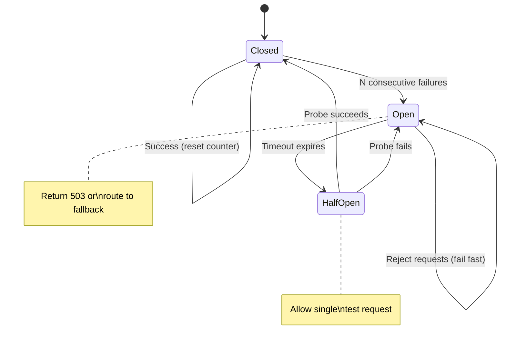
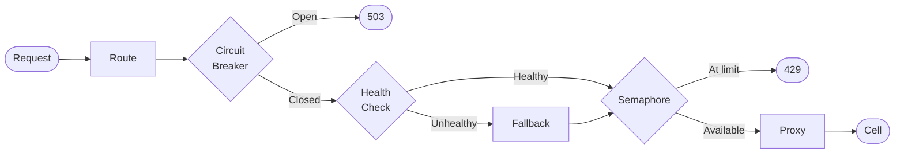

# Milestone 4: Stateless Resilience

## Goal

Add local failure detection and overload protection without introducing shared state or control-plane dependencies. Keep the router stateless, fast, and predictable.

## Features

### 1. Health-Aware Routing

**Active health checks** per endpoint, in-memory only.

- Periodic HTTP health probe (e.g., `GET /health` every 10s)
- Track per-endpoint state: `healthy` / `unhealthy`
- On unhealthy: route to fallback placement (e.g., tier3)
- Health state never blocks requests

**Why**: Detect upstream failures early. Avoid sending traffic to dead cells.

**Not implementing**: Passive health checks, distributed health state.

### 2. Circuit Breaking

**Per-endpoint circuit breaker** to prevent cascading failures.



- **Closed**: Normal operation
- **Open**: Fail fast after N consecutive errors (e.g., 5)
- **Half-Open**: Test recovery after timeout (e.g., 30s)

When open: route to fallback or return 503.

**Why**: Prevent retry storms. Isolate failing cells. Give upstream time to recover.

**Not implementing**: Distributed circuit state, complex recovery strategies.

### 3. Overload Protection

**Bounded resources** to prevent router saturation.

- **Connect timeout**: 5s
- **Request timeout**: 10s
- **Max request body**: 10MB
- **Concurrency limit per placement**: Semaphore (e.g., 100 concurrent requests to tier1)

When limits exceeded: reject early with 429 or 503.

**Why**: Protect router and upstream. Explicit failure over silent degradation.

**Not implementing**: Distributed rate limiting, per-customer quotas.

## Architecture Invariants

All [architectural invariants](../../README.md#architectural-invariants) are preserved. M4-specific constraints:

- **Local resilience state**: Health checks, circuit breakers, semaphores are per-router (no coordination)
- **Acceptable variance**: Multiple routers may make different failover decisions during transient failures
- **Fast path untouched**: Resilience checks add negligible overhead to routing decisions

## Config Schema

```yaml
placement_to_endpoint:
  tier1:
    url: http://cell-tier1:9001
    fallback: tier3
    health_check:
      path: /health
      interval: 10s
      timeout: 2s
    circuit_breaker:
      failure_threshold: 5
      timeout: 30s
    concurrency_limit: 100
```

## Request Flow



## Out of Scope

**No distributed rate limiting**: Would require Redis or shared state. Contradicts stateless design.

**No automatic retries**: Retries require idempotency guarantees. Client layer decides.

**No authentication**: Router trusts `X-Routing-Key`. Auth happens upstream.
